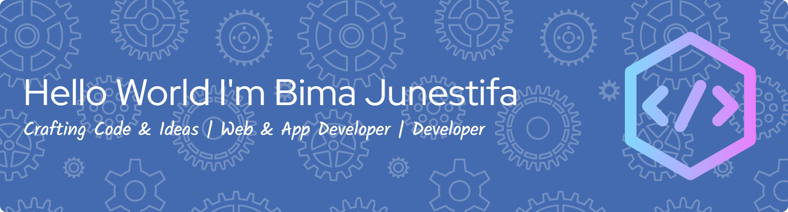

# 💫 Tentang Saya

## Hello World! I'm Bima Junestifa 👋

Saya adalah seorang **Web Developer** yang berfokus pada pengembangan aplikasi web menggunakan teknologi modern. Saat ini saya sedang aktif mempelajari dan mengembangkan berbagai proyek menggunakan **Laravel Framework** serta teknologi web lainnya.

---

## 🌐 Media Sosial

---

---

## 🛠️ Keahlian

---

<table border="1" cellpadding="10" cellspacing="0" style="border-collapse: collapse; width: 100%;">
<tr>
<td valign="top" style="border: 1px solid #ddd; padding: 15px; text-align: left;">

### 🎨 Frontend

---

 
 
 
 

</td>
<td valign="top" style="border: 1px solid #ddd; padding: 15px; text-align: left;">

### ⚙️ Backend

---

 
 
 

</td>
<td valign="top" style="border: 1px solid #ddd; padding: 15px; text-align: left;">

### 🗄️ Database

---

 
<!--  -->

</td>
<td valign="top" style="border: 1px solid #ddd; padding: 15px; text-align: left;">

### 🤖 AI & Machine Learning

---

<!--  --> 
 

</td>
<td valign="top" style="border: 1px solid #ddd; padding: 15px; text-align: left;">

### 🔧 Version Control & Tools

---

 
 
 
 

</td>
</tr>
</table>

---

## 📊 GitHub Stats

---

---

## 🏆 GitHub Trophies

---

---

## 🔝 Top Contributed Repo

---

---

## 🎮 Mainkan Game Bersama Saya

---

<picture>
  <source media="(prefers-color-scheme: dark)" srcset="https://raw.githubusercontent.com/bimajunestifa/bimajunestifa/output/pacman-contribution-graph-dark.svg">
  <source media="(prefers-color-scheme: light)" srcset="https://raw.githubusercontent.com/bimajunestifa/bimajunestifa/output/pacman-contribution-graph.svg">
  
</picture>

  

---

<!-- 

  

 -->
