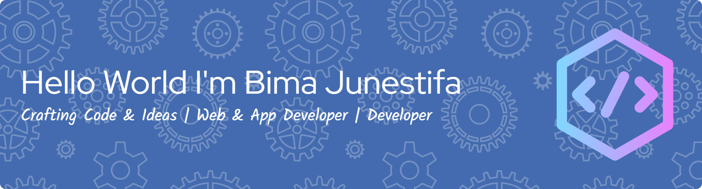

  

<h1 align="center">Hi, saya Bima Junestifa 👋</h1>

  <strong>Web Developer • App Developer • ETL Enthusiast • Cyber Security Learner</strong>

  Saya senang membangun aplikasi yang bermanfaat, mengolah data menjadi informasi, 
  dan mempelajari cara menjaga sistem tetap aman.

  
  
  

---

## 👨‍💻 Tentang Saya

- 🔭 Berfokus pada pengembangan aplikasi **web dan mobile**.
- 🌱 Aktif mempelajari **Laravel**, **ETL/Data Engineering**, dan **Cyber Security**.
- 🧩 Menyukai proses mengubah ide menjadi solusi digital yang rapi dan mudah digunakan.
- 🤝 Terbuka untuk kolaborasi, diskusi teknologi, dan pengembangan proyek baru.

## 🛠️ Tech Stack

### Web & Mobile Development

  
  
  
  
  
  
  

### Database & ETL

  
  
  

`Data Extraction` • `Data Cleaning` • `Data Transformation` • `Data Loading`

### Cyber Security

  
  
  
  
  

`Security Fundamentals` • `Web Security` • `Network Security` • `Ethical Hacking`

### AI, Design & Development Tools

  
  
  
  
  
  
  

---

## 🕹️ Pac-Man Contribution Graph

  <picture>
    <source media="(prefers-color-scheme: dark)" srcset="https://raw.githubusercontent.com/bimajunestifa/bimajunestifa/output/pacman-contribution-graph-dark.svg" />
    <source media="(prefers-color-scheme: light)" srcset="https://raw.githubusercontent.com/bimajunestifa/bimajunestifa/output/pacman-contribution-graph.svg" />
    
  </picture>

---

  <em>Terus belajar, terus berkembang, dan terus menciptakan sesuatu yang bermanfaat.</em> 🚀

